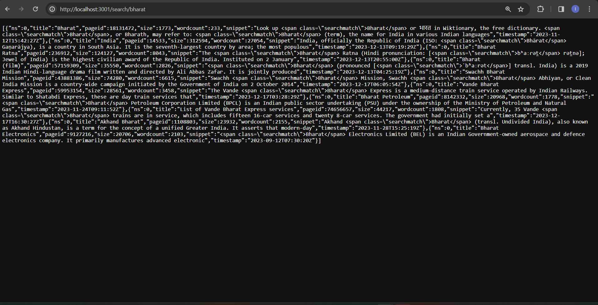
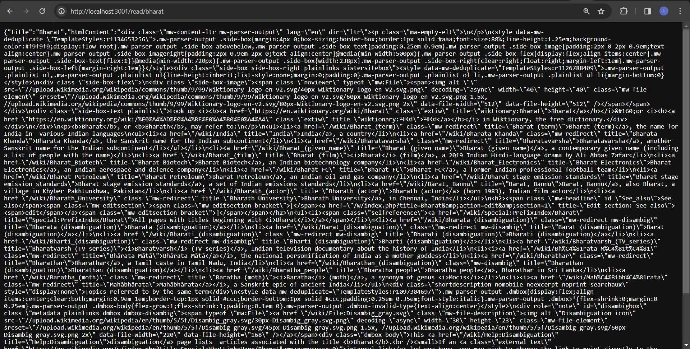
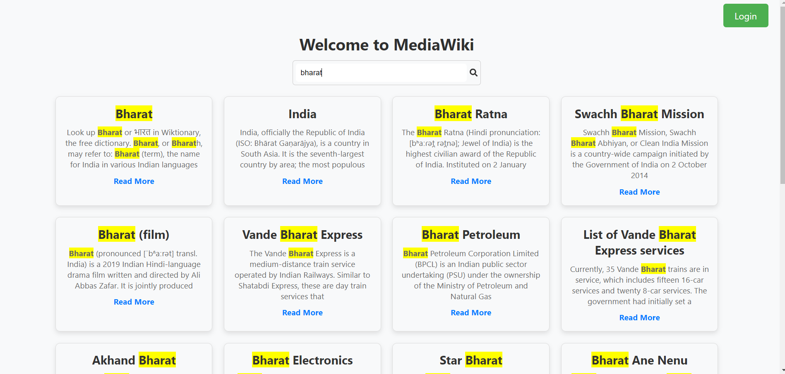
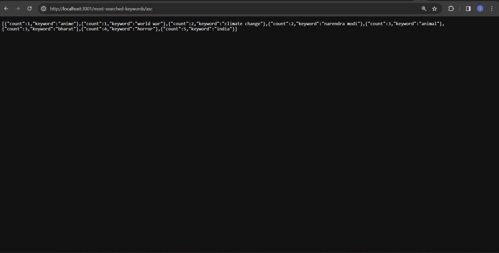
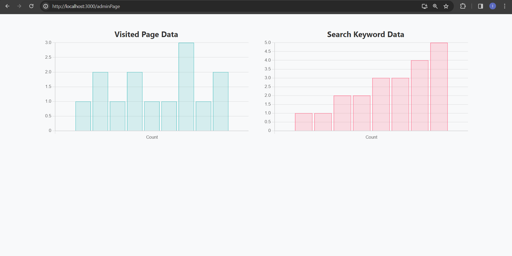
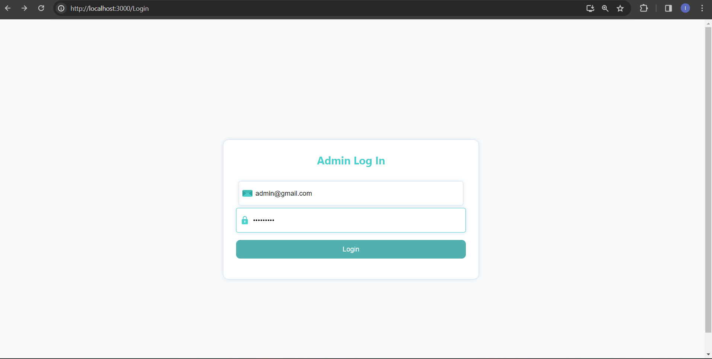

# TiniWiki

TiniWiki is a Wikipedia search application that allows users to search Wikipedia pages and view details about the pages they are interested in.

## Features

- **Search Wikipedia Pages:** Users can search for Wikipedia pages by entering keywords in the search bar.

- **Visited Pages Tracking:** TiniWiki tracks visited pages, recording the page ID, title, URL, count, and timestamp. The data is stored in a MongoDB database.

- **Most Searched Keywords:** Users can retrieve the most searched keywords, with the ability to order the results in ascending or descending order based on the number of searches.

- **Visualization of all keyword search by user only for admin:** Users can retrieve the most searched keywords, with the ability to order the results in ascending or descending order based on the number of searches.

## Technologies Used

- **Frontend:** React.js
- **Backend:** Node.js, Express.js
- **Database:** MongoDB
- **State Management:** React Hooks
- **Charting Library:** Chart.js

## Task 1

 **1.1**  Express challenge
   GET /search/:searchTerm 
   Returns an array of Wikipedia pages that match the keyword 

   

   **1.2**  Express challenge
    GET /read/:slug 
    Returns a JSON object containing html content for the page along with its title 

  

## Task 2

 **2.1**  React challenge
    Landing Page / Search Page 
   This page should contain a search bar in which the user can type in the keywords they want to  search Wikipedia with. It should make an AJAX request to the API to fetch a list of pages that  match the entered keyword. After which, it should display the results to the user.

   

   **2.2**  React challenge
    When a user clicks on a search result in the Search Page, this page should open containing the  Wikipedia content of the selected search result. It should make an AJAX request to the API and  display the HTML content of the page returned by it.

    
   When user click on read more button that user is redirected to that wikipedia page

  
## Task 3
 
 **3.1**  MongoDB challenge
 Persist some analytical data in the backend of your application using MongoDB: Modify your existing express routes to store the searched keywords and visited pages in your local  MongoDB database. You can store any other properties that you feel might be appropriate alongside  them. 
Create a new route that outputs a JSON array showing the most searched keywords in either ascending  or descending order based on a route parameter “asc” or “desc”. 

 

**3.2**  Bonus challenge

As a bonus task, you can use a charting library to display analytical data in your Angular / React  application based on the information collected in your MongoDB database. 

## Task 4  

**4.1** Admin Login

• Only admin access must be implemented (no registration system required). • The authentication should be based on JWTs. 
• Only admins should have access to analytical data. 
• A dashboard page should be created that shows charts and graphs based on the data stored in  the MongoDB database. 

email id : admin@gmail.com
password:  admin@123

all user chart is visible in admin panel only

